# Lecture 1: CNN

## Universal Approximation Theorem (UAT)

若 $\varphi$ 是一个非常数，有界（bounded）且单调递增的函数。对于任意 $\epsilon >0$，对于任何定义定义在 $\mathbb{R}^m$ 的紧凑子集（compact subset）的连续函数$f$，存在一个整数 $N$ 、实数常数 $\alpha_i, b_i \in \mathbb{R}$和实数向量  $\mathbf{w}_i \in \mathbb{R}^{\text{dim }\mathbf{x}}$ 使得：
$$
F(\mathbf{x}) = \sum^N_{i=1}
\alpha_i\varphi(\mathbf{w}_i^\top \mathbf{x} + b_i) \\\text{ 且 }\\
| F(\mathbf{x}) - f(\mathbf{x}) |
< \epsilon
$$

> |      符号      |       意义       |
> | :------------: | :--------------: |
> |   $\varphi$    |     激活函数     |
> | $\mathbf{w}_i$ |     权重向量     |
> |     $b_i$      |      偏置项      |
> |   $\alpha_i$   |    输出层权重    |
> |   $\epsilon$   |     逼近精度     |
> |      $N$       | 隐层神经元的数量 |

> 需要注意，这里相当于定义了一个 $N\times \text{dim }\mathbf{x}$ 的权重矩阵 $W=\{\mathbf{w}_1,\mathbf{w}_2,\cdots,\mathbf{w}_N\}$

任何定义在 $\mathbb{R}^m$ 的紧集上的连续函数都可以被单隐层神经网络以任意精度逼近（前提是选择正确的激活函数）。实践中 $\epsilon$ 会很大。

**Curse of Dimensionality (维度的诅咒)**：随着特征维度上升，需要实现准确泛化的数据量指数增长。

> 在精度 $\epsilon$ 去近似 Lipschitz 连续函数 $f : \mathbb{R}^d \to \mathbb{R}$，需要 $O(\epsilon^{-d})$ 个样本。

> **高维空间的重量/质量主要集中在外壳**
>
> 对于体积的缩放，假设一个 $n$ 维的物体，其体积缩放了 $\alpha$ 倍，则其外壳为：
> $$
> 1-\alpha^n
> $$
> 相对于 $\alpha$ 的增长率为：
> $$
> \frac{d}{d\alpha}(1-\alpha^n) = -n\alpha^{n-1}
> $$
> 当我们从无收缩（no shrink）开始（即$\alpha=1$），然后逐渐减小 $\alpha$ 时，边缘层的体积会以初始维度 $n$ 倍的速率增长。
>
> 在高维空间中，距离的微小变化可能会对体积产生放大效应。一个维度上的细微变化可能导致体积的巨大变化。
>
> 背景：如果考虑这个空间是一个披萨，而腊肠均匀分布。
>
> 如果我们期望使得披萨面积变小一半，则我们期望半长度 ($\alpha$)
> $$
> \alpha^n = \frac{1}{2}
> \longrightarrow
> \begin{align*}
> \alpha &= 2^{-\frac{1}{n}}
> \\&= 1-\frac{\log 2}{n}
> \\&\approx 1-\frac{0.7}{n}
> 
> \end{align*}
> $$
> 对于2维披萨，$\alpha =1-0.35$
>
> 而 3 维，则只有 1-0.23

## Invarianc vs Equivariance

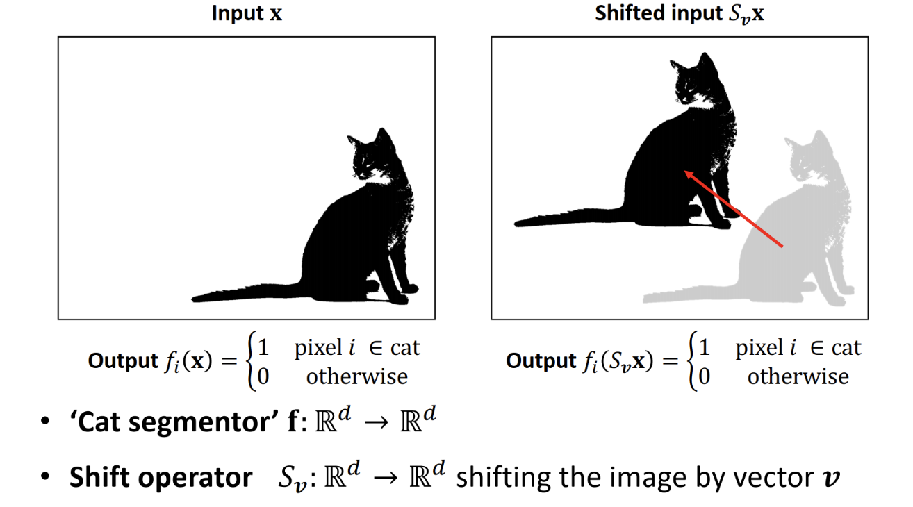

与Shift Invarience（输出保持不变，无论输入如何移动）相比，Shift Equivariance 的运作方式有所不同。

想象一个对图像进行分割的模型，将属于猫的每个像素标记为"1"，其他像素标记为"0"。

在这种情况下，如果图像中的猫移动了，分割后的输出也应该以完全相同的方式移动。

简单来说，位移等变性意味着在函数之后应用位移操作得到的结果，与在位移之后应用函数得到的结果相同。

| Invariance（不变性）                                         | Equivariance（等变性）                                       |
| ------------------------------------------------------------ | ------------------------------------------------------------ |
| 无论输入如何变化，输出保持不变                               | 输入的变化会导致输出发生相应的、可预测的变化                 |
| 例如：人脸识别系统 - 当同一个人的照片向左移动或向右移动时 - 系统都应该输出"这是同一个人" - 输出结果不会随着图像的位移而改变 | 例如：图像分割系统 - 如果猫在图像中向右移动了 50 个像素 - 分割结果（标记为猫的区域）也应该向右移动 50 个像素 - 输出会随着输入的变化而相应变化 |
| $f(T(x)) = f(x)$                                             | $f(T(x)) = T(f(x))$                                          |

考虑位移操作 $T$

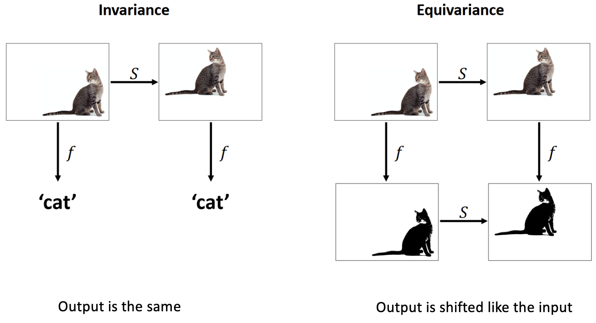

Translation Invariance & Locality
$$
\begin{align*}

\text{Subimage: } &
\hat{I}_{i,j} = I[i:i+m, j:j+n] \\
\text{Correlation: }&
C_{i, j} = \sum^{m-1}_{x=0}\sum^{n-1}_{y=0}
\hat{I}_{i, j}(x, y)\cdot \kappa(x, y)

\end{align*}
$$

## FC / MLP

| 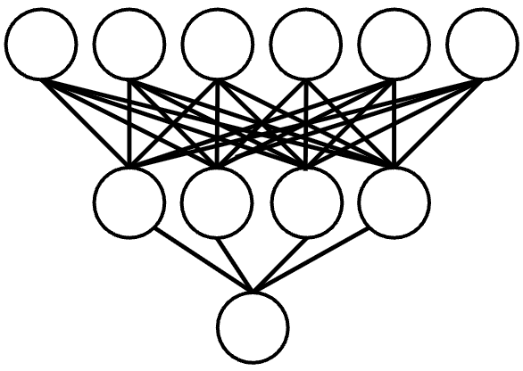 | 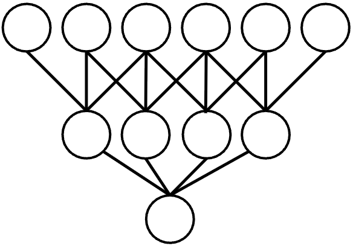 | 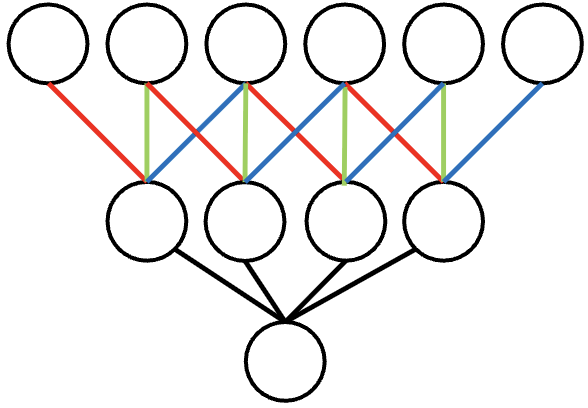 |
| :----------------------------------------------------------: | :----------------------------------------------------------: | :----------------------------------------------------------: |
|                            FC NN                             |                    Sparsely Connected NN                     |                      Weight Sharing NN                       |
|                       $N^2$ parameters                       |                    $k\times N$ parameters                    |                        $k$ parameters                        |
| 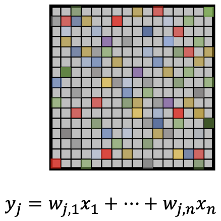 | 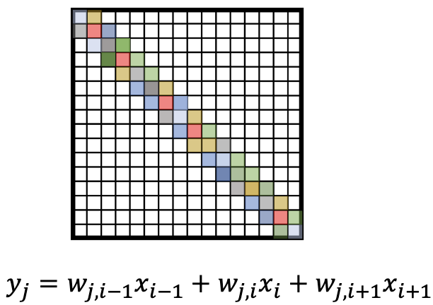 | 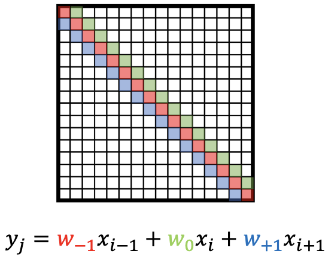 |

## Convolution

$$
\begin{align*}
\text{Convolution: } &
(f* g)(x) =
\int^\infty_{-\infty}
f(\tau)g(x - \tau) d\tau
\text{ for } f,g: [0, \infty)\in \mathbb{R}
\\
\text{Correlation: } &
(f\star g)(x) =
\int^\infty_{-\infty}
f(\tau)g(x + \tau) d\tau
\text{ for } f,g: [0, \infty)\in \mathbb{R}

\end{align*}
$$

> https://www.youtube.com/watch?v=N-zd-T17uiE
>
> https://www.youtube.com/watch?v=IaSGqQa5O-M

### Property

$$
\begin{align*}
\text{Commutativity: } &
f * g = g * f
\\
\text{Associativity: } &
f * (g*h) = (f * g) * h
\\
\text{Distributivity: } &
f * (g+h) = (f * g) + (f*h)
\\
\text{Scalar (Asso.): } &
\alpha * (f*g) = (\alpha f) * g
\end{align*}
$$

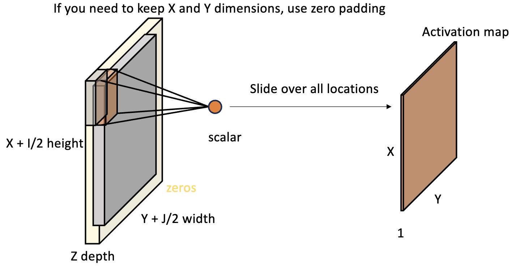

$$
I' = \left\lfloor
\frac{I+2P-K_I}{S}

\right\rfloor
+1
$$

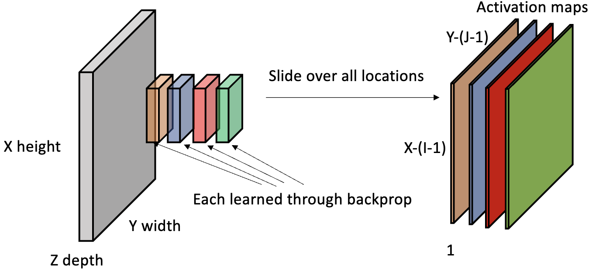
$$
I_{(X\times Y\times Z)} * \boldsymbol{\kappa}_{(M\times I\times J\times Z)}
= O_{(M\times X-(I-1)\times Y-(J-1))}
$$
每一个 $\kappa$ 有 $I\times J \times M + 1$ 个参数需要学习。

### Computational Complexity & Factorised Convolution

对于一个 $5\times 5$ 的卷积核，对于每个输入需要进行 $25$ 次乘法和加法运算。我们可以用 $2$ 个 $3\times 3$ 的卷积核替换。尽管是 computational less expenive 但是可能无法capture同级别的细节。

在两个 3x3 卷积之间插入激活函数会引入额外的非线性，使近似更能捕捉复杂的特征。然而，这仍然与单个 5x5 过滤器提供的“可能性”或参数空间不匹配。因此，当您选择这种分解时，请记住您正在做出权衡：以牺牲一些表示能力为代价来获得计算效率。

## Pooling

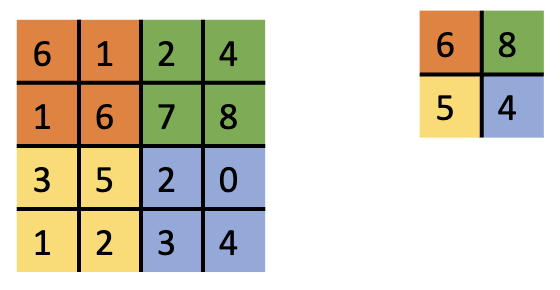

Permutation-Invariant Aggregation + Downsampling (max/avg)

Hierarchical Features：随着层级的增加，池化有助于网络集中于越来越抽象的特征，从而增加层次

Shift/Deformation Invariance: robust against small shift/deformation

### 信号理论

> **奈奎斯特采样定理 Nyquist sampling theorem**
>
> 要完整地重建一个带限连续信号，采样频率必须至少是信号最高频率分量的2倍。这个最低要求的采样频率被称为奈奎斯特频率。
>
> 如果一个信号的最高频率是 $f$，那么采样频率 $f_s$ 必须满足： $f_s \geq 2f$
>
> 举个实际的例子：
>
> - 人耳能听到的声音频率范围大约是20Hz 到20kHz
> - 因此，CD音质的采样频率被设定为44.1kHz，就是为了满足奈奎斯特采样定理
> - 这确保了可以完整地记录和重建人耳可听范围内的所有声音
>
> 如果违反奈奎斯特采样定理会发生什么：
>
> 1. 混叠(Aliasing)：当采样频率低于奈奎斯特频率时，会产生混叠现象
> 2. 信息丢失：高频信息会被错误地表示为低频信息
> 3. 失真：重建后的信号会与原始信号有显著差异

- 在CNN中，池化层和步进卷积实际上是在进行降采样
- 如果不考虑奈奎斯特定理，可能会导致特征信息的混叠和丢失
- 这就是为什么有时需要在降采样前添加低通滤波器（抗混叠滤波 Anti Aliasing），以确保信息的准确保留

在设计神经网络架构时，不能忽视基础的信号处理原理，需要在降采样操作时谨慎考虑信息保留问题。

MaxPooling 可能破坏 shift equivariance

|  原始信号  | 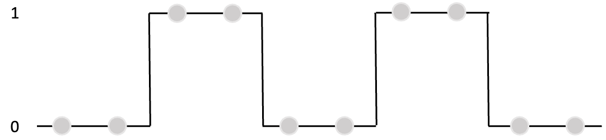 |
| :--------: | :----------------------------------------------------------: |
|            | 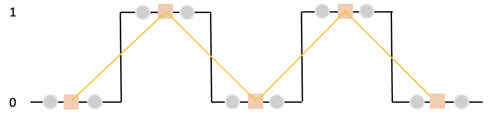 |
| 破坏的信号 | 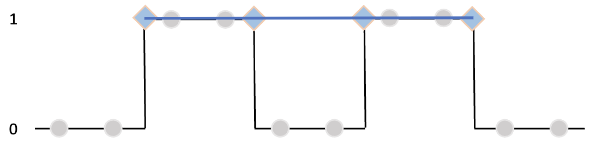 |

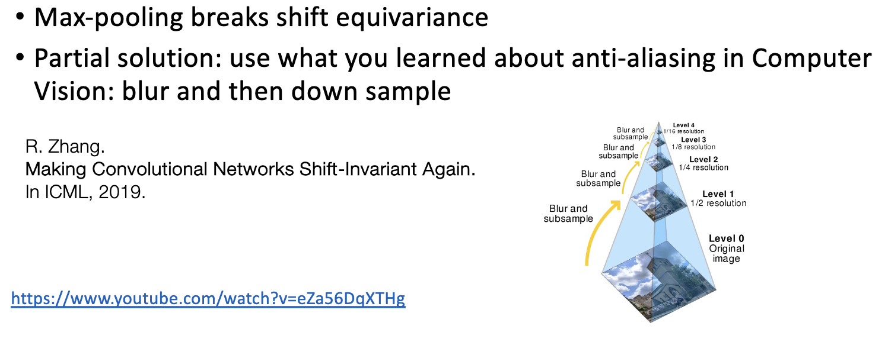

### Rotation Equivariance: Group Equivariance

> https://www.youtube.com/watch?v=qoWAFBYOtoU

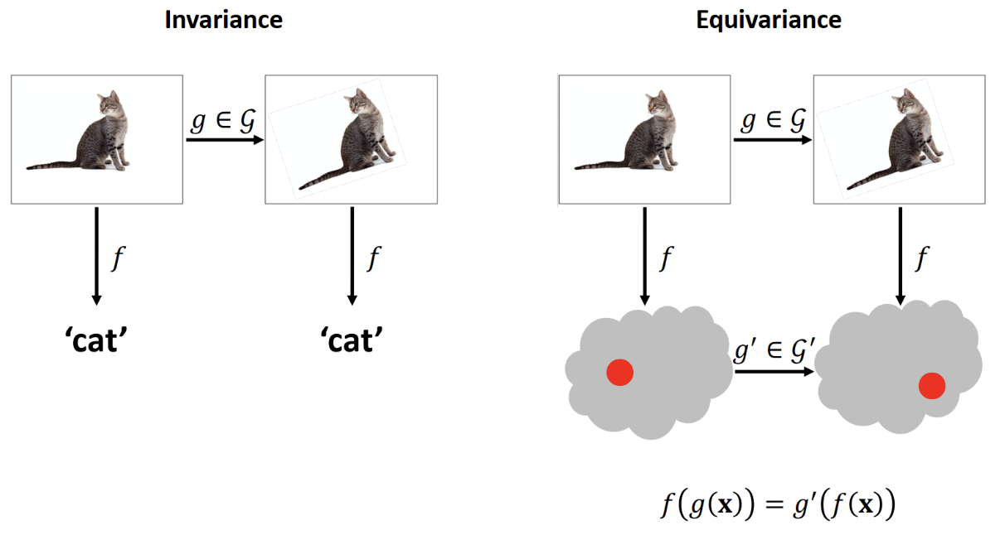

> 群是一个与某个运算相结合的元素集合，这个运算具有封闭性，意味着两个元素的组合总是会得到同一集合中的另一个元素。旋转就是群的一个简单例子。如果你将一个物体向左旋转一点，然后再次旋转，这两次旋转可以合并成一次等效旋转，达到相同的最终效果。

标准的CNN并不天然具有旋转等变性。

**谐波网络（Harmonic Networks）**或H-Nets 是CNN的一种特殊形式，它不仅对平移具有等变性，还对360度旋转具有等变性。这是通过用所谓的"循环谐波"替换CNN中的标准滤波器来实现的。这些特殊设计的滤波器确保输入的旋转会在输出特征图中产生相应的旋转，从而实现旋转等变性。

### (Approximate) Deformation Invariance

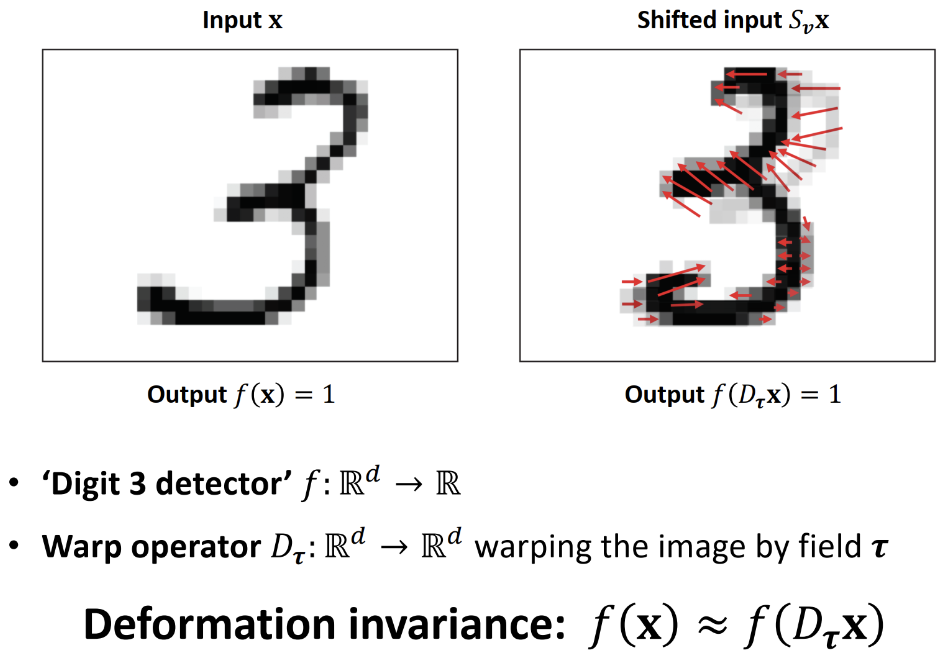

扭曲操作是对图像像素应用平滑变形场，略微移动它们以创建一个新的但相似的排列。CNN特别擅长处理这些小的、局部的移动。

CNN最初是考虑平移不变性而设计的。CNN不仅对大规模、容易定义的变换（如平移和旋转）具有不变性；它们对这些微妙、复杂的变形也具有近似不变性。
$$
|| f(\mathbf{x}) - f(D_\tau \mathbf{x})||
\approx ||\nabla \tau ||
$$

Constant Shift: 每个像素都以相同的方向移动相同的距离

CNN 具有平移不变性。但是实际上 shift 是不均匀的：有些像素可能移动很大距离，而其他像素可能几乎不动。可以用 variable vector field $\tau$ 描述。

CNN在这些情况下的有效性取决于其学习这些复杂的、非恒定位移和变形的能力。正是这种细微的适应性往往区分了好的CNN模型和杰出的CNN模型。

> **Sumamry**
>
> CNN 的不变性(Invariance)和等变性(Equivariance)特性：
>
> **卷积层的等变性(Equivariance)**
> - 当输入发生平移时，特征图的输出也会相应地平移
> - $$f(T(x)) = T(f(x))$$
> - 其中 $T$ 是平移操作，$f$ 是卷积操作
> - 这意味着如果输入图像向右移动3个像素，那么卷积后的特征图也会向右移动3个像素
>
> **池化层的局部平移不变性(Local Translation Invariance)**
> - 当输入发生小范围平移时，池化后的输出保持不变
> - 以最大池化为例，在池化窗口内的小幅度平移不会改变输出值
> - 这有助于网络对输入的小扰动保持稳定性
>
> **整个CNN的平移不变性(Translation Invariance)**
> - 通过多层卷积和池化的组合，CNN最终对较大范围的平移具有不变性
> - 这意味着无论物体在图像中的位置如何，CNN都能够识别出来
> - 数学表示为：$$f(T(x)) ≈ f(x)$$
>
> **（Harmonic Networks) 旋转等变性（Rotation Equivariance）**
>
> - 使用**圆谐函数(Circular Harmonics)** $e^{im\theta}$ 作为卷积核基函数来实现旋转等变性。
> - 输入旋转角度时：$e^{im(\theta+\alpha)} = e^{im\theta}e^{im\alpha}$
> - 卷积核被定义为圆谐函数和径向函数（Radial Function）的乘积：$W(r,θ) = R(r)e^{imθ}$
>   - Radial Function $R(r)$ 是一个只依赖于到原点距离 $r$ 的函数
>   - $R(r) = R(||\mathbf{w}||)$
> - 对输入进行旋转 $f(\mathbf{x}. \theta)\to f(\mathbf{x}. \theta+\alpha)$
> - 卷积操作 $[f * W](\mathbf{x}. \theta + \alpha) = e^{im\alpha}[f*W](\mathbf{x}. \theta)$
> - 输出特征图按照可预测的方式变换（乘以$e^{im\alpha}$
>
> 值得注意的是：
>
> 1. CNN默认只具有平移相关的等变性和不变性
> 2. 对于旋转、缩放等其他变换，标准CNN并不具备相应的不变性
> 3. 如果需要其他类型的不变性，需要通过数据增强或特殊的网络设计来实现
>
> 这些特性使得CNN特别适合处理图像识别任务，因为在实际应用中，我们希望模型能够识别出物体，而不管它在图像中的具体位置。
