# Lecture 2 Activation, Loss Function

## Activation Function

**Heaviside Step function**
$$
g(x) = \begin{cases}
1, & x\geq0\\
0, & x < 0
\end{cases}
$$
无梯度，无法BP

**Linear**
$$
g(x) = c \cdot x
$$
常数梯度，与 $x$ 无关

**Sigmoid**
$$
\sigma (x) = \frac{1}{1+e^{-x}} \\
\sigma(x) \in (0, 1)
$$
非线性

**TanH**
$$
g(x) = \frac{e^x-e^{-x}}{e^x+e^{-x}} \\g(x) \in (-1, 1)
$$
Scaled Sigmoid

**ReLU**
$$
g(x) = \max (0, x)\\
g(x) \in [0, \infty)
$$
高效，ReLU的组合是非线性的。dying ReLU problem。

当输入值为负数时，ReLU函数会将其变为0，这本身没问题。但问题在于:

1. 如果在训练过程中,某个神经元的输入总是为负值,那么这个神经元的输出就会一直是0
2. 更严重的是,由于在反向传播时,ReLU对负值输入的梯度也是0,这意味着这个"死掉"的神经元将无法通过梯度更新来"复活"

**Leaky ReLU**
$$
g(x) = \begin{cases}
x, & x\geq0\\
\lambda x, & x < 0
\end{cases}
\\
\text{for example: } \lambda = 0.001
$$
减缓 dying ReLU

PReLU
$$
g(x) = \begin{cases}
x, & x\geq0\\
a x, & x < 0
\end{cases}
\\
a \text{ is learnable}
$$
每个输入通道使用一个或单独的  $a$

**SoftPlus**
$$
g(x) = \frac{1}{\beta}\log(1+e^{(\beta\cdot x)})
$$
ReLU 的圆滑近似。

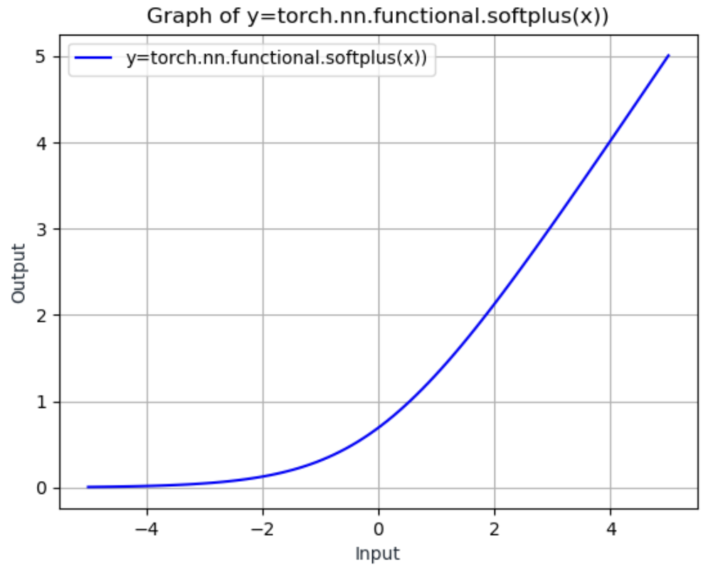

输出总positive。为了数值稳定性（Numerical stability），当 $(\beta\cdot x) > \theta$ ($\theta$ 是阈值)，使用线性。

**ELU**

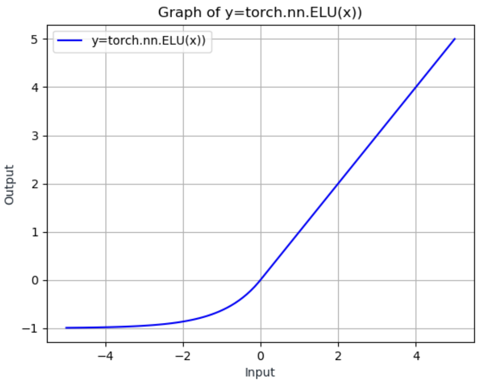
$$
g(x) = \max(0, x)+ \min(0, \alpha(e^x - 1))
$$
Element wise, $\alpha$ is hyperparam.

**CELU**

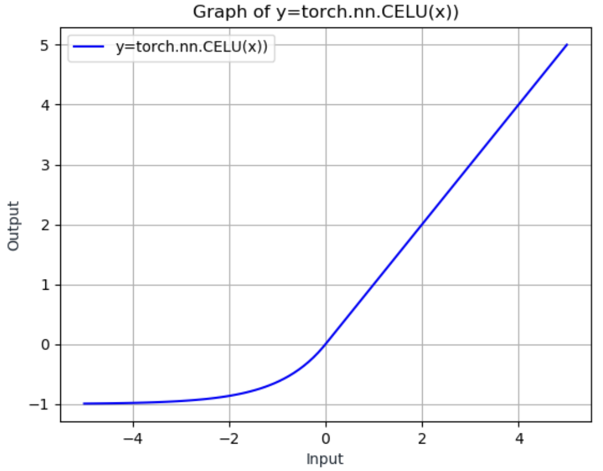
$$
g(x) = \max(0, x)+ \min(0, \alpha(e^{\frac{x}{\alpha}} - 1))
$$
CELU 与 ELU 的主要区别在于负值部分的计算方式，CELU 在指数项中引入了 $\alpha$ 的缩放，使得函数具有更好的数值稳定性。

**SELU**

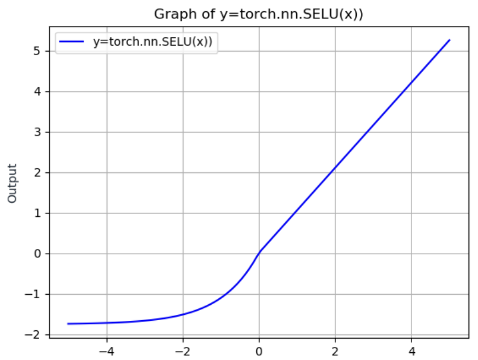
$$
g(x) = \text{scale}\cdot
[\max(0, x)+ \min(0, \alpha(e^{x} - 1))]
\\
\text{where } \alpha = 1.6732632423543772848170429916717, \text{scale} = 1.0507009873554804934193349852946
$$
**GELU**

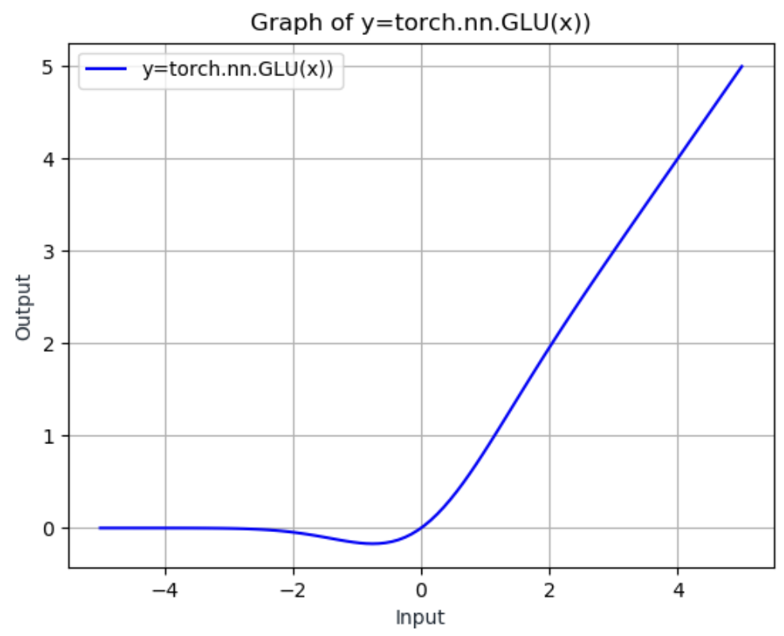
$$
y = x\cdot\Phi(x)
$$

$\Phi(x)$ is Cumulative Distribution Function for Gaussian Distribution

**ReLU6**

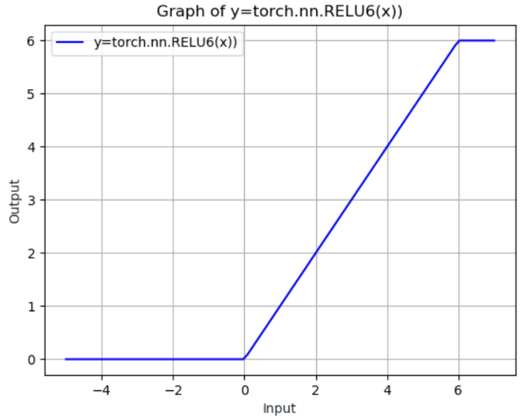
$$
g(x) = \min(\max(0, x), 6)
$$
**LogSigmoid**

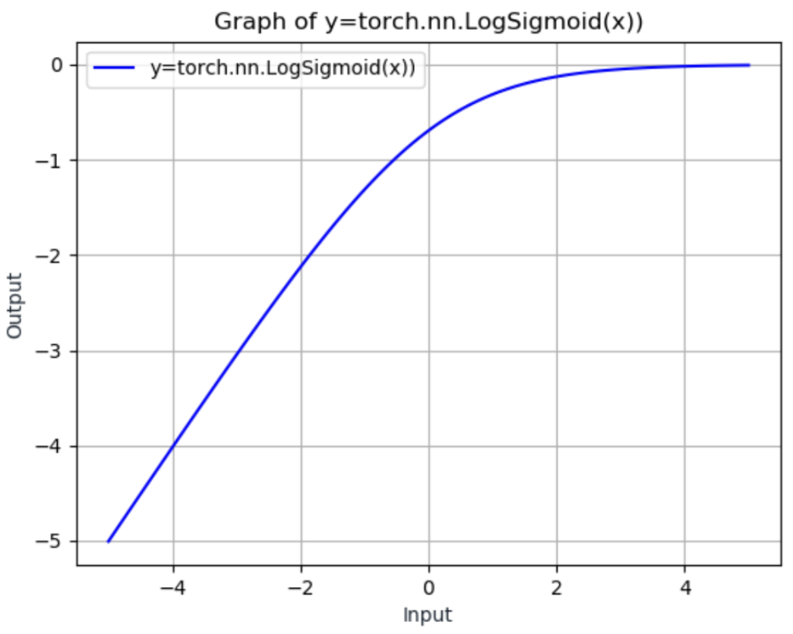
$$
g(x) = \log \left(
\frac{1}{1+e^{-x}}

\right)
$$
Element-wise

**Softmin**

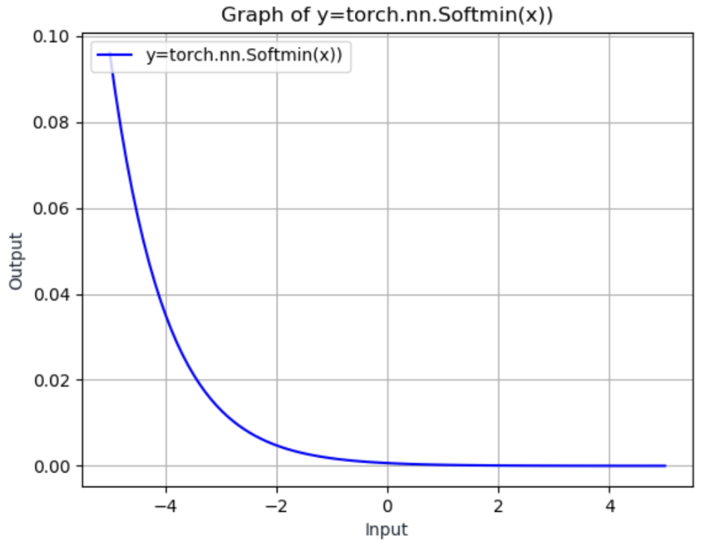
$$
g(\mathbf{x}) = \frac{e^{-x_i}}{
\sum_{j} e^{-x_j}
}
$$
**Softmax**

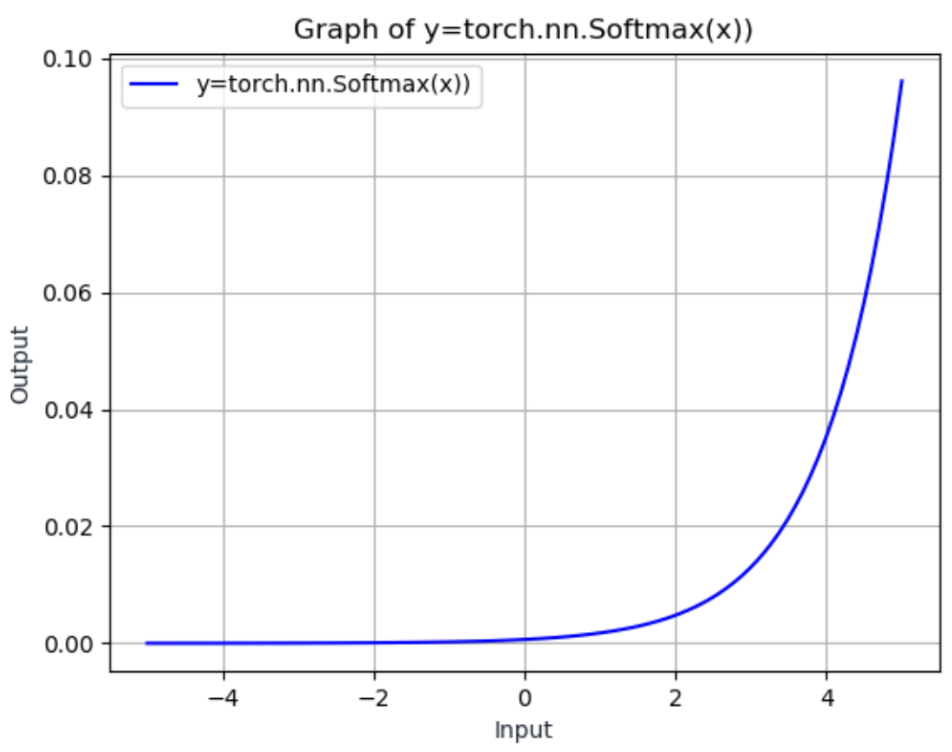
$$
g(\mathbf{x}) = \frac{e^{x_i}}{
\sum_{j} e^{-x_j}
}
$$
**LogSoftmax**

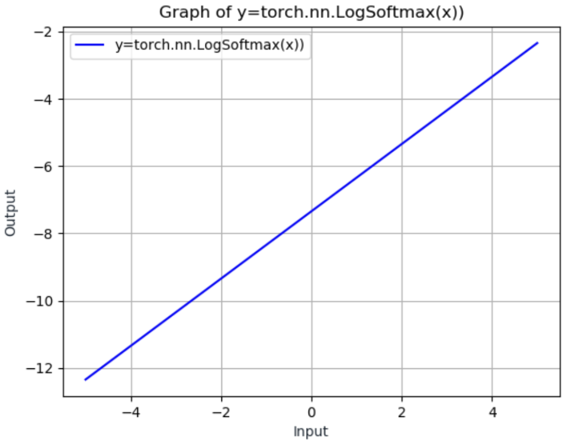
$$
g(\mathbf{x}) = \log \left(
\frac{e^{x_i}}{
\sum_{j} e^{-x_j}
}
\right)
$$
**周期性激活函数/Periodic activations：SIREN**

对一般问题有较难的收敛性质

已被用于隐式表示（找到一个连续函数来表示稀疏输入数据，例如图像）
$$
\Phi(\mathbf{x}) =
\mathbf{W}_n(\phi_{n-1}\circ\phi_{n-2}\circ\cdots\circ\phi_{0})(\mathbf{x}) + \mathbf{b}_n\\
\mathbf{x}_i \mapsto\phi(\mathbf{x}_i)=\sin(
\mathbf{W}_i\mathbf{x}_i+\mathbf{b}_i)
$$

- 使用正弦函数作为激活函数，而不是传统的ReLU等
- 这种周期性激活函数能够更好地学习连续信号和隐式表示
- 特别适合表示具有高频细节的数据，如图像、声音等

## Loss Function

### L2/L1/Smooth L1 Norm

$$
\ell(\mathbf{x},\mathbf{y}) = 
\mathcal{L} = \{l_1, l_2, \cdot, l_n \}^\top\\
\text{where }\cdots
$$

| 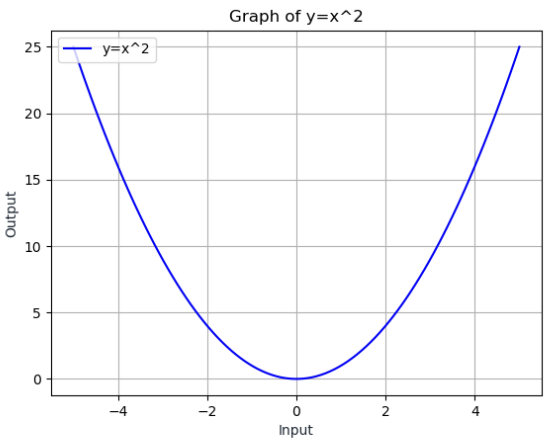 | 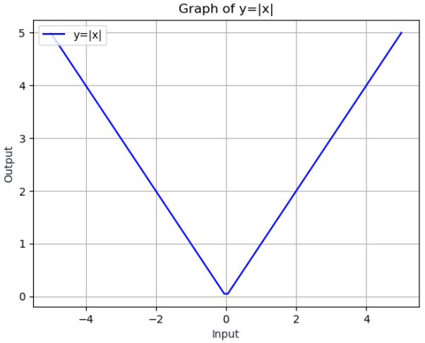 | 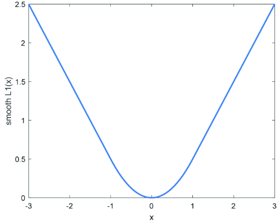 |
| :----------------------------------------------------------: | :-----------------------------------------: | :-----------------------------------------: |
|                         **L2 **(MSE)                         |                   **L1**                    |                **Smooth L1**                |
|                      $l_n = x_n - y_n$                       |            $l_n = (x_n - y_n)^2$            |        $l_n = \frac{1}{n}\sum_i z_i$        |

$$
\text{Smooth L1}:
l_n = \frac{1}{n}\sum_i z_i
\\
z_i = \begin{cases}
0.5(x_i-y_i)^2
& \text{if }|x_i-y_i| < 1 \\

|x_i - y_i | - 0.5
& \text{otherwise}

\end{cases}
$$

### Neg Log Likelihood Loss `nn.NLLLoss()`

假设：网络输出表示对数似然（log liklihoods）。
目标是让正确类别的对数似然值尽可能大，而其他类别的尽可能小
$$
l_n = - \mathbf{w}_{y_n}^\top\mathbf{x}_{n, y_n'} \\
\mathbf{w}_c = \text{weight}[c]\cdot \mathbb{1} \{c \neq \text{ignore}_\text{index} \} \\
$$
有两种 reduction = {mean, sum}
$$
\ell (\mathbf{x}, \mathbf{y})
=
\begin{cases}
\sum^N_{n=1}
\frac{1}{\sum^N_{n=1}\mathbf{w}_{y_n}}{l_n}
&\text{if reduction = mean}
\\
\sum^N_{n=1}
l_n
&\text{if reduction = sum}
\end{cases}
$$

### Cross Entropy (CE) Loss `nn.CrossEntropyLoss()`

LogSoftmax 和 NLLLoss 的组合
$$
\text{loss}(x, c)= -\log
\left(
\frac{e^{x[c]}}{\sum_j e^{x[j]}}
\right)
=
-x[c]+ \log
\left(
\sum_j e^{x[j]}
\right)
\\\text{where } c \text{ is class}
$$

### Binary Cross Entropy (BCE) Loss `nn.BCELoss()/nn.BCEWithLogitsLoss()`

$$
l_n = -w_n[y_n\cdot \log x_n  + (1-y_n)\cdot\log(1-x_n)]
$$

Reduction = {mean, sum}

Requires [0,1] probabilities. If this cannot be guaranteed, use nn.BCEWithLogitsLoss()

> Reduction $\mathbf{x} \to x$

### Kullback-Leibler Divergence Loss `nn.KLDivLoss()`

$$
l_n
= y_n\cdot \left(\log \frac{y_n}{x_n}\right)
= y_n\cdot (\log y_n-\log x_n)
$$

### Margin Ranking Loss/Ranking Losses/Contrastive loss `nn.MarginRankingLoss()`

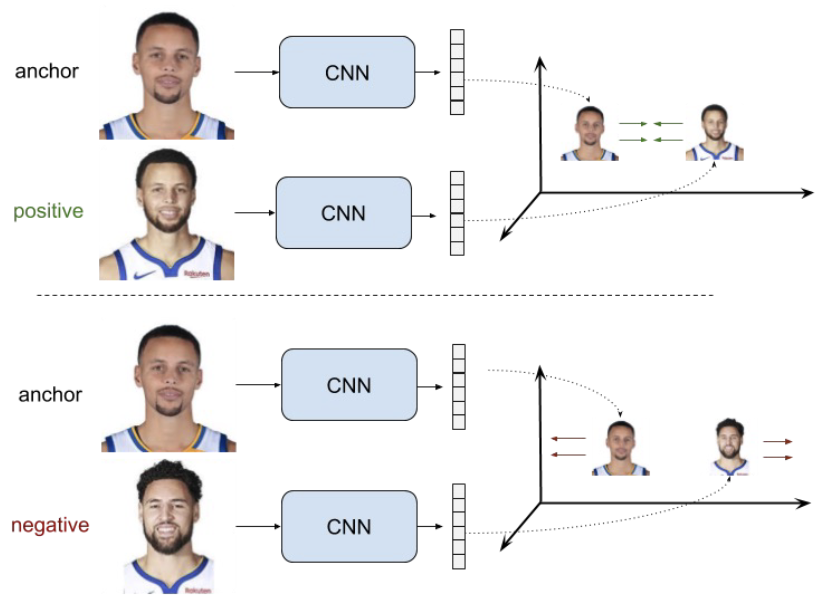

有用的做法是把类别尽可能地推得更远，这对于度量学习（metric learning）很有帮助。

实际操作：选取得分最接近或高于正确类别的那个类别，持续调整直到差距至少达到预设的边界值。
$$
\text{loss}(x, y) =
\max(0, y\cdot(x_1-x_2)+\text{margin})
$$

- $x_1$ 和 $x_2$ 是两个样本的预测分数
- $y$ 通常是 $+1$ 或 $-1$，表示两个样本是否属于同一类
- $\text{margin}$是一个正数，表示期望的最小差距

**工作原理**：

- 当 $y=1$ (同类样本)时：
  - 期望 $x_1 ≈ x_2$，它们的差值应该很小
  - 损失函数变为 $\max(0, (x_1-x_2)+\text{margin})$
  - 推动 $x_1$ 和 $x_2$ 更接近
- 当 $y=-1$ (不同类)时：
  - 期望 $x_1$ 和 $x_2$ 差距大
  - 损失函数变为 $\max(0, -(x_1-x_2)+\text{margin})$
  - 推动分数差异至少达到 margin

### Triplet Margin Loss `nn.TripletMarginLoss()`

$$
l_n(x_a, x_+, x_-) =
\max (0, m+|f(x_a) - f(x_+)|-|f(x_a) - f(x_-)|)
$$

$$
\begin{cases}
x_a & \text{Actual Sample/Anchor} \\
x_+ & \text{Positive Sample} \\
x_- & \text{Negative Sample}

\end{cases}
$$

使来自相同类别的样本距离接近，不同类别的样本距离远离。

目标：良好配对的距离必须小于不良配对的距离。实际距离不需要很小，只需要相对更小。

用于度量学习和孪生网络

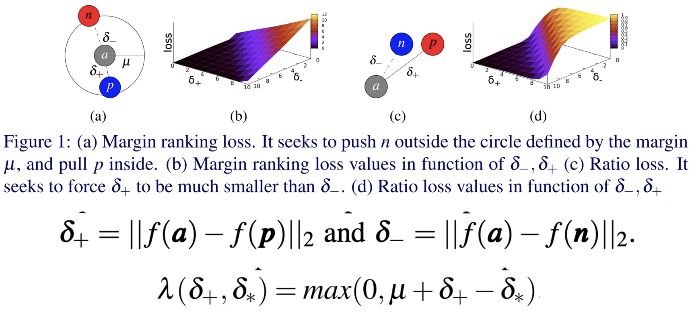

(a) Margin ranking loss。它试图将 n 推到由边界 $\mu$ 定义的圆圈外，并将 $p$ 拉到圆圈内。  
(b) Margin ranking loss 值作为 $\delta_-$, $\delta_+$的函数。  
(c) Ratio loss。它试图强制 $\delta_+$ 远小于 $\delta_+$。  
(d) Ratio loss 值作为  $\delta_-$, $\delta_+$ 的函数。

### Cosine Embedding Loss `nn.CosineEmbeddingLoss()`

$$
\text{loss}(x, y) =

\begin{cases}
1 - \cos(x_1, x_2)
&\text{if } y =1
\\
\max(0, \cos(x_1, x_2) - \text{margin})
&\text{if } y =-1
\end{cases}
$$

测量两个输入是相似还是不相似
基本上是归一化的欧几里得距离