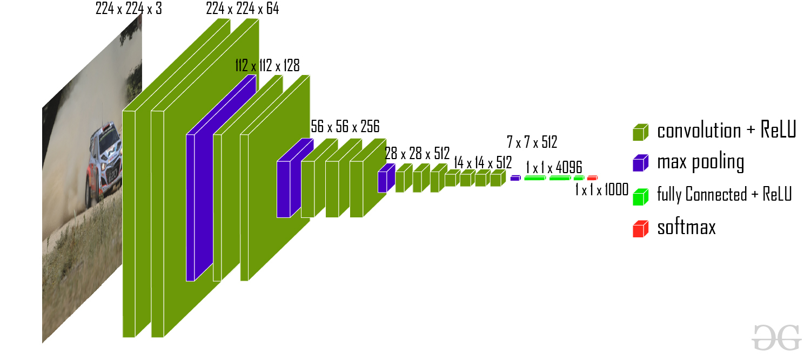
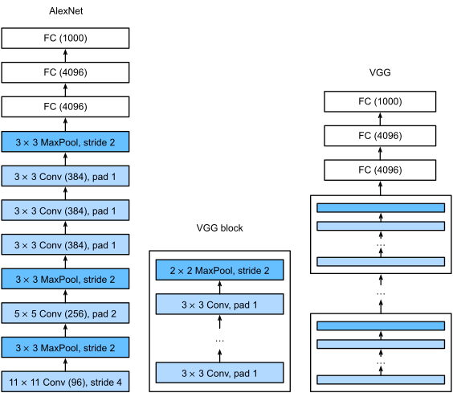

# Lecture 4: CNN Architecture

## LeNet-5


$$
X : 32\times 32
\\
Y = Conv(28\times 28, ch=6)\\
$$

```python
X : 32x32
C1 = Conv2D(X)                  : 6 @ 28x28
S2 = AvgPool(C1, 2x2)           : 6 @ 14x14
C3 = Conv2D(S2)                 : 16 @ 10x10
S4 = AvgPool(S3)                : 16 @ 5x5
C5 = FC(S4)                     : 120
F6 = FC(C5)                     : 84
Y = GaussianRadialBasisFunc(F6) : 10

```


> MNIST 数据集
>
> 50,000 Training Samples  
> 10,000 Test Samples  
> 28x28  Images  
> 10     Clases  

##  AlexNet


分成两列是因为时代局限性。

为了让模型能够运行，架构被分配在两个GPU之间，每个GPU处理一半的神经元或特征图。

在conv1、conv2、conv4和conv5这样的层中，来自同一GPU的特征图被用于连接。

然而，在conv3以及FC6、FC7和FC8这样的层中，两个GPU都需要通信，以便让神经元能够完整地查看前一层的输出。


LeNet 到 AlexNet

> ImageNet (2010)
>
> 

AlexNet 不只是更大版本的 LeNet

- Dropout Regularisation
- ReLU
- MaxPooling 以替代 AvgPooling，更大的池化层。这样可以对抗shift-invariant
- 增大的 Kernel Size 和 Stride，因为更高清的图片


AlexNet 相比于 LeNet 有 250 倍的 Computationally Expensive，但是参数只是10倍大。

（trade-off between computation 和 memory）

## VGG






Deep 且 Narrow 更好！

## GoogLeNet (Inception)


LeNet 使用 5x5, AlexNet 使用 11x11，3x3，5x5.VGG更专注于使用1x1。如何获得最佳组合？

如果使用5x5可能会很多参数（计算缓慢），可能 cvf。对于 1x1内存有效，但是不perform well。

Inception Block混合了所有。


第一个 Inception 模块的通道数量已经被明确定义为：

- 1x1 卷积使用 64 个通道
- 3x3 卷积使用 128 个通道
- 5x5 卷积使用 32 个通道

这些数字不是随意选择的，而是经过精心设计，使得所有通道最终加起来等于 256 个通道。这种明确的通道数量规范对于保持网络结构的一致性和性能很重要。

> GoogLeNet（Inception v1）通常会包含多个 Inception 模块，它们被串联在一起。而这里特别指出是"第一个"，是因为不同位置的 Inception 模块可能会使用不同的通道数配置。
>
> - 第一个 Inception 模块可能用上述配置（64、128、32等通道）
> - 而后面的 Inception 模块可能会使用不同的通道数配置，以适应网络在不同层次的需求


Inception 模块的设计目标是在不牺牲性能的前提下，使用相对较少的参数和浮点运算（FLOPs）。

> 如果你需要 256 个输出通道，使用 Inception 模块只需要 160,000 个参数和 128 兆 FLOPs。
>  相比之下，如果只使用 3x3 卷积，将会消耗大约三倍的参数和 FLOPs。 而如果只使用 5x5 卷积，成本将增加约八倍，这使得 Inception 模块效率要高得多。

> Computational Cost
>
> 如果考虑 Inception 特定层的一个 $K\times K$ 核，输入channel 和 输出channel分别是 $C_\text{in}. C_\text{out}$.
>
> 则参数为 $K^2 \times C_\text{in}\times C_\text{out}$
>
> 考虑原始图片为 $W\times H$
>
> 因此直接使用单一最大的卷积层：$K^2 \times C_\text{in}\times C_\text{out}\times W \times H$
>
> 对于常数项进行排布，即为
> $$
> \{ C_\text{in} \times W\times H \} \times \{K^2 \times C_\text{out} \}
> $$
> 如果使用多个核心，$K_{1..N}$，每个核 $K_j$ 输出channel 为 $C_{\text{out}, j}$
>
> 则权重为
> $$
> \{ C_\text{in} \times W\times H \}
> \times \sum_{\text{第 } j \text{ 个核}}[
>   K_j^2 \times C_{\text{out}, j}
> 
> ]
> $$
> 

### 阶段分析


Stage 1: 更大的卷积核池化保证不变性并降低维

Stage 2：捕捉空间相关性

Stage 3：降低分辨率（MaxPooling）同时增加通数获得更高维特征


Stage 1 & 2：更小的 Kernel Size 和输出 channel（更多层）


### 改进

- Inception-BN (v2) – added batch normalisation
- Inception-V3 – Modified the inception block
  - Replace 5x5 by multiple 3x3 convolutions 
  - Replace 5x5 by 1x7 and 7x1 convolutions
  - Replace 3x3 by 1x3 and 3x1 convolutions
  - Generally deeper stack
- Inception-V4 – adds residual connections 

#### V3

Stage 3


wide and shallow networks < deep and narrow

Stage 4


使用 1x7 和 7x1 替换（更关注横着还是竖着的特性）。通常是为了特定任务做的优化。

Stage 5


使用 1x3 和 3x1 替换 3x3。

## Batch Norm

