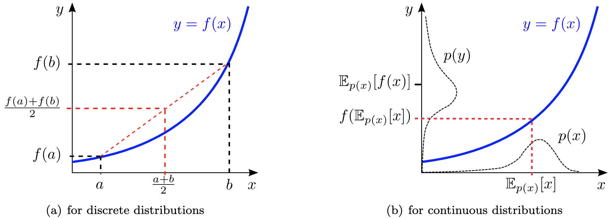
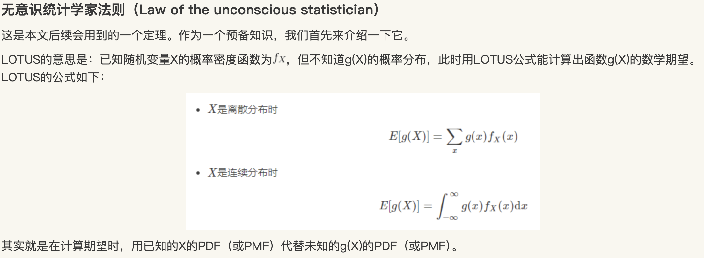
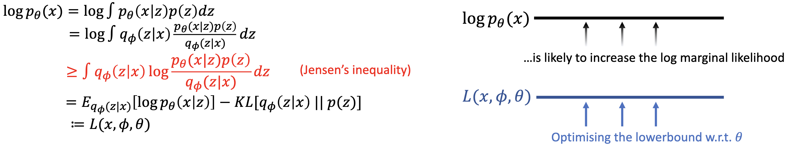
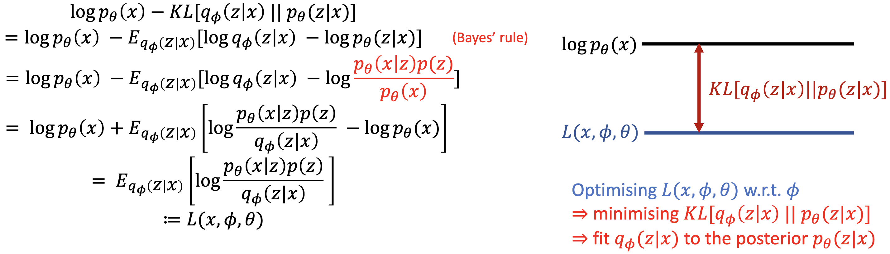

# Lec 8: VAE

## Generative Model

> Divergence $D[p\, ||\, q]$ 是有效的divergence iff
>
> - $D [p \, || \,q] = 0 \lrarr p = q$
> - 或者说 $p(x) \neq q(x) \rarr D[p\, || \, q] > 0$

我们希望 ProbDist $p_\theta (x) \approx p_\text{data}(x)$

生成模型的目标是
$$
\theta^* = \arg \min_\theta D[p_\text{data} \, ||\, p_\theta]
$$
 KL 散度：
$$
\begin{align*}
D_\text{KL} [p(x)\, ||\, q(x)]
&=
\mathbb{E}_{p(x)}\left[
\log
\frac{p(x)}{q(x)}
\right]
\\
&= \sum_{x\in \mathcal{X}}p(x)
\log
\left(
\frac{p(x)}{q(x)}
\right)
\end{align*}
$$

> **Convex**
> $$
> \frac{f(a) + f(b)}{2} \geq f(\frac{a+b}{2})
> $$

> **Jensen's Inequality**
>
> **Proposition 1.** *(Jensen’s inequality)* 如果 $f : \mathbb{R} \to \mathbb{R}$ 是 convex的，则对于任意分布 $p(x)$：
> $$
> \mathbb{E}_{p(x)}[f(x)] \geq
> f(\mathbb{E}_{p(x)} [x] )
> $$
> 取=, iff. $f$ 是 linear 或者 $p(x)$ 是delta measure
>
> 
>
> **Proposition 2.** *(LOTUS)* 给定dist. $p_X(x)$ 和函数 $y=g(x)$, 使得 $\mathbb{E}_{p_X(x)}[g(x)] < \infty$，随机变量 $Y = g(X)$ 拥有满足 $\mathbb{E}_{p_Y(y)}[y]=\mathbb{E}_{p_X(x)}[g(x)]$ 的 dist $p_Y(y)$ 
>
> 
>
> **Proposition 3.** *(Generalised Jensen’s Inequality)* 如果函数 $g(x) : ? \to \mathbb{R}$ 且 $f(\mathbb{R}) : \mathbb{R} \to \mathbb{R}$，$f$ 是 convex，对于任何分布 $p_X(x)$：
> $$
> \mathbb{E}_{p_X(x)}[f(g(x))] \geq f(\mathbb{E}_{p_X{(x)}}[g(x)])
> $$
> 取=, iff. $f$ 是 linear 或者 $p(x)$ 是delta measure
>
> Proof.
> $$
> \begin{align*}
> \mathbb{E}_{p_X(x)}[f(g(x))]
> &= 
> \mathbb{E}_{p_Y(y)}[f(y)]
> & \text{(LOTUS)}
> 
> \\&\geq
> f (\mathbb{E}_{p_Y(y)}[y])
> & \text{(Jensen’s Inequality)}
> 
> \\&=
> f (\mathbb{E}_{p_X(x)}[g(x)])
> & \text{(LOTUS)}
> \\
> \square.
> \end{align*}
> $$

> **为什么 KL 散度是一个有效的 Divergence**
> $$
> \begin{align*}
> \text{case } p=q: & 
> D_\text{KL} = 
> \mathbb{E}_{p(x)}\left[
> \log 1
> \right] = 0
> \\
> 
> \text{case }p\neq q : &
> \end{align*}
> $$
>
> $$
> \begin{align*}
> D_\text{KL}[p \, ||\, q] & =
> \mathbb{E}_{p(x)}\left[
> \log
> \frac{p(x)}{q(x)}
> \right]
> 
> \\
> &= 
> \mathbb{E}_{p(x)}\left[
> -\log
> \frac{q(x)}{p(x)}
> \right]
> \end{align*}
> $$
>
> 考虑凸函数 $f = -\log (x)$,  $g(x)=\frac{q(x)}{p(x)}$
> $$
> \begin{align*}
> D_\text{KL}[p \, ||\, q] & =
> \mathbb{E}_{p(x)}\left[
> f(g(x))
> \right]
> 
> \\&\ge
> f (\mathbb{E}_{p(x)}\left[
> g(x)
> \right])
> 
> &\text{(Jensen’s inequality)}
> \\&=
> -\log 
> \mathbb{E}_{p(x)}\left[
> \frac{q(x)}{p(x)}
> \right]
> 
> \\&= 
> -\log\int p(x)\left[
> \frac{q(x)}{p(x)}
> \right] dx
> 
> \\&= -\log 1
> \\&= 0
> \end{align*}
> $$
>

## MLE

以下都会使用 KL 作为 Divergence，也就计作 $D$
$$
\theta^* = \arg \min_\theta D_\text{KL}[p_\text{data} \, ||\, p_\theta]\\

D_\text{KL} [p(x)\, ||\, q(x)]=
\mathbb{E}_{p(x)}\left[
\log
\frac{p(x)}{q(x)}
\right]
$$

$$
\begin{align*}
D_\text{KL}[p_\text{data(x)} \, ||\, p_\theta]
&=
\underbrace{
\mathbb{E}_{p_\text{data}}[\log p_\text{data}(x)]
}_{\text{constant}}
-

\underbrace{
\mathbb{E}_{p_\text{data}(x)}[\log p_\theta(x)]
}_{\text{depend on } \theta}

\end{align*}
$$

因此任务可以重写为
$$
\theta^* = \arg \max_\theta

\mathbb{E}_{p_\text{data}(x)}[\log p_\theta(x)]
$$
实践中，使用 empirical distribution 在数据集 $\{ x_n \}^N_{n=1} \sim p_\text{data}$ 近似，也就是：
$$
\theta^* = \arg \max_\theta
\frac{1}{N}\sum_{n=1}^N
\log p_\theta(x_n)
$$
## Variance Inference

> 变分推断是一种近似贝叶斯推断的方法。在很多实际问题中,我们需要计算后验分布 $p(z\mid x)$,但直接计算往往非常困难或者计算量太大。这时候我们就需要变分推断来帮助我们得到一个近似的后验分布。
> $$
> p(z \mid x) = \frac{p(x\mid z) p (x)}{p(x)} = 
> \frac{p(x\mid z) p (x)}{\int p(x, z) dz}
> $$
> 分母中的积分难以计算，使用VI进行近似！（也就是下面的LVM）
>
> > 参阅 https://zhuanlan.zhihu.com/p/138184201

VI 就是为了 fit Latent Variable Model (LVM)到数据分布：
$$
p_\theta(x) = \int p_\theta(x \mid z) p(z) dz
$$
在 VI 语境下，分布被定义为：
$$
p(z) = \mathcal{N}(z; 0, I)\qquad p_\theta(x \mid z)=\mathcal{N}(x; G_\theta(x), \sigma^2 I)\\
\text{where }G_\theta(x) \text{ 是神经网络，参数为 }\theta
$$
我们无法计算 $z$ 的积分（因为空间很大），而 VI 提供了变分下界（lower bound）$\mathcal{L}$，可以用 $\log p_\theta(x)$ 近似：

对于任何 $q(z) > 0$ 的分布 $q$，每当 $p_\theta(z\mid x)> 0$ 有：
$$
\begin{align*}

\log p_\theta (x) &= \log \int p_\theta(z \mid x) p(z) dz
\\

&=

\log \int q(z)\frac{p_\theta(x \mid z)p(z)}{q(z)} dz

\\&\ge \int q(z)\log\frac{p_\theta(x \mid z)p(z)}{q(z)} dz
\\&=
\mathbb{E}_{q(z)}[\log p_\theta(x\mid z)] + \int q(z)\log\frac{p(z)}{q(z)} dz
\\&=
\mathbb{E}_{q(z)}[\log p_\theta(x\mid z)] - D_\text{KL}[q(z) \, ||\, p(z)]
& := \mathcal{L}(x, q, \theta)
\end{align*}
$$

注意到下界 $\mathcal{L}$ 有如下关系：
$$
\begin{align*}

\log p_\theta (x)-
D_\text{KL}[q(z) \, ||\, p_\theta (z\mid x)]
&=
\log p_\theta (x)-
\mathbb{E}_{q(z)}
\left[\log
\frac{q(z)}{p_\theta (z\mid x)}
\right]

\\&=
\log p_\theta (x)-
\mathbb{E}_{q(z)}
\left[\log
\frac{q(z)p_\theta(x)}{p_\theta (x\mid z)p(z)}
\right]

\\&=
\log p_\theta (x)-
\mathbb{E}_{q(z)}
\left[\log
\frac{q(z)}{p(z)}
+
\log
\frac{p_\theta(x)}{p_\theta (x\mid z)}
\right]

\\&=
\log p_\theta (x)-
\mathbb{E}_{q(z)}
\left[\log
\frac{q(z)}{p(z)}
\right]
-
\mathbb{E}_{q(z)}
\left[\log
\frac{p_\theta(x)}{p_\theta (x\mid z)}
\right]

\\&=
\log p_\theta (x)-D_\text{KL}[q(z) \, ||\, p(z)]
-
\mathbb{E}_{q(z)}
\left[\log
\frac{p_\theta(x)}{p_\theta (x\mid z)}
\right]

\\&=

\mathbb{E}_{q(z)}
\left[\log
\frac{p_\theta (x\mid z)}{p_\theta(x)}+
\log p_\theta (x)
\right]
-D_\text{KL}[q(z) \, ||\, p(z)]

\\&\vdash
\mathbb{E}_{q(z)}[\log p_\theta(x\mid z)] - D_\text{KL}[q(z) \, ||\, p(z)]
& := \mathcal{L}(x, q, \theta)

\end{align*}
$$
即：
$$
\begin{align*}
\log p_\theta (x)
&\ge \mathbb{E}_{q(z)}[\log p_\theta(x\mid z)] - D_\text{KL}[q(z) \, ||\, p(z)]
& := \mathcal{L}(x, q, \theta)
\\
\\
\log p_\theta (x)-
D_\text{KL}[q(z) \, ||\, p_\theta (z\mid x)]
&= \mathcal{L}(x, q, \theta)

\\
\log p_\theta (x)
&= \mathcal{L}(x, q, \theta)
+ \underbrace{D_\text{KL}[q(z) \, ||\, p_\theta (z\mid x)]}_{\epsilon}

\end{align*}
$$
可以发现近似误差是 $q(z)$ 和 $p_\theta(z\mid x)$ 的divergence。当 $q(z)$ 接近真实后验分布 $p_θ(z\mid x)$ 时，这个下界会得到改善

## VAE: Variational Auto-Encoders

$$
p(x) \xrightarrow[p_\phi(z\mid x)]{\text{Encoder}}{p(z)}
\xrightarrow[p_\theta(y\mid z)]{\text{Decoder}} p(y)
$$

